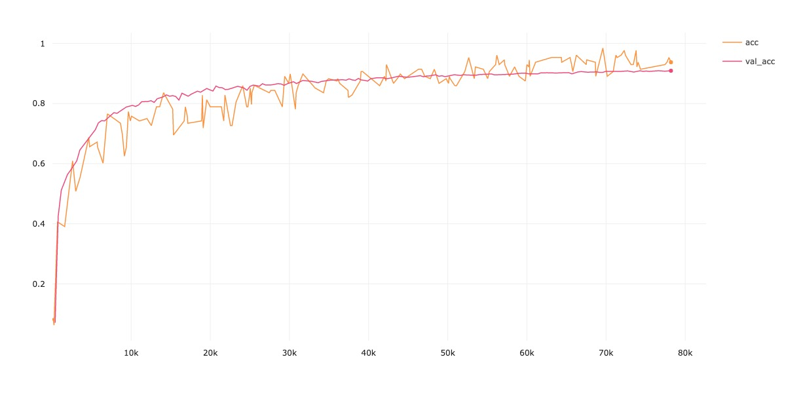
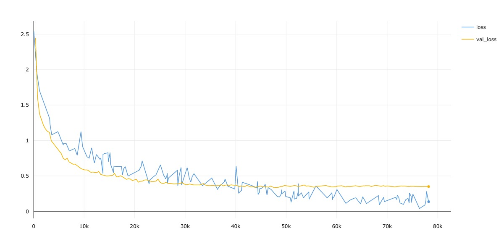
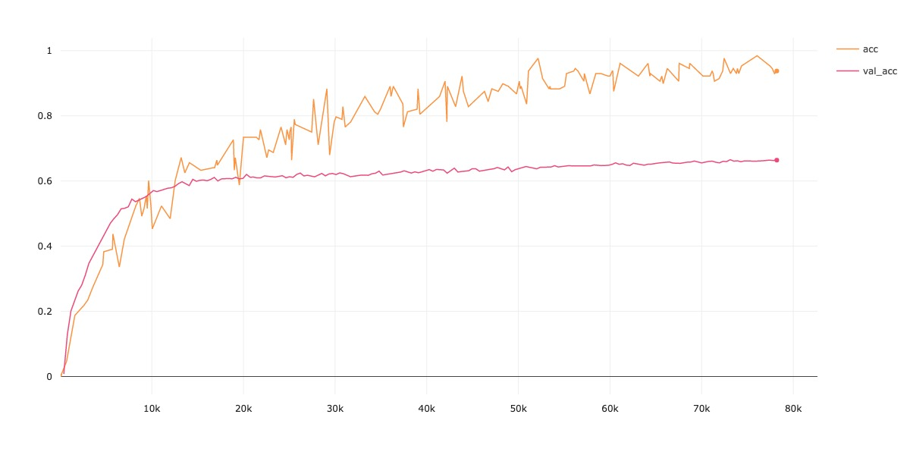
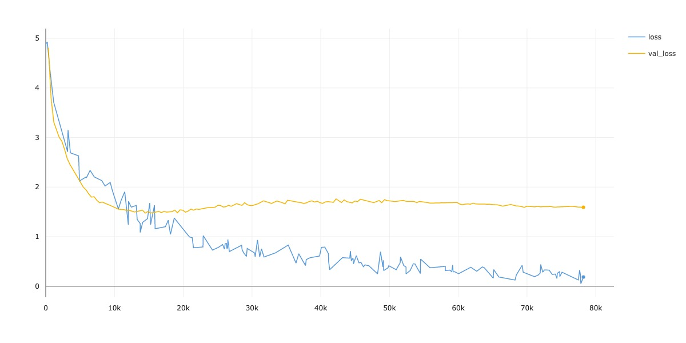
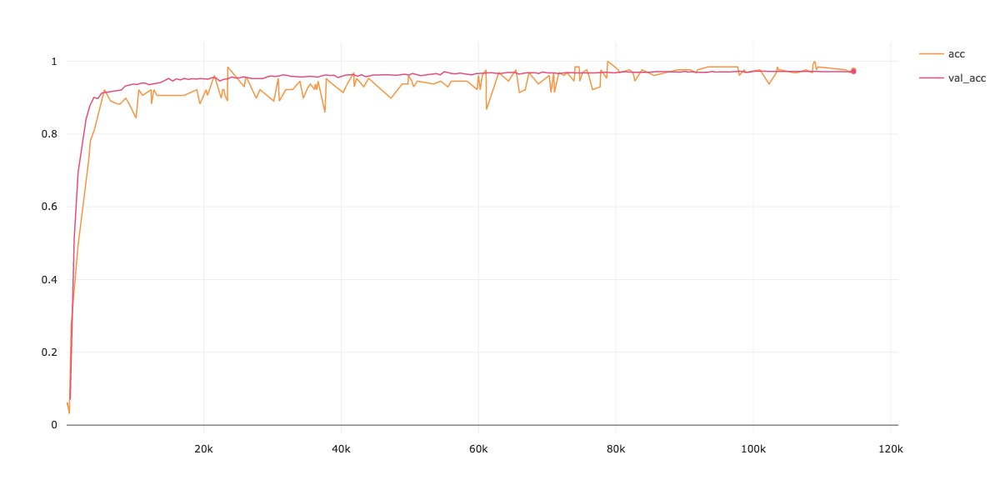
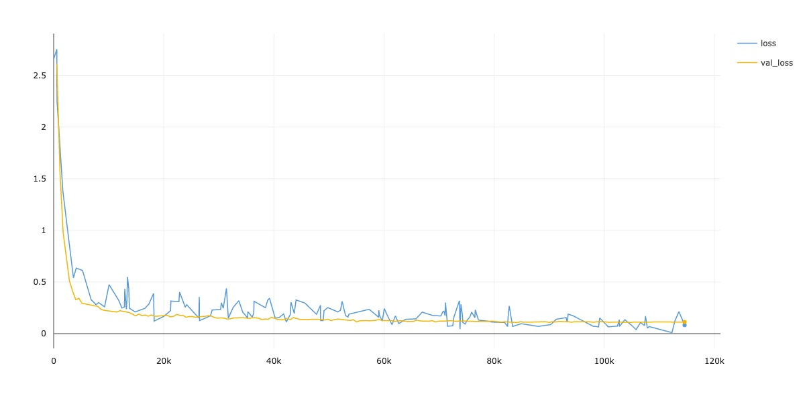

# ViT-CIFAR

PyTorch implementation for Vision Transformer[[Dosovitskiy, A.(ICLR'21)]](https://openreview.net/forum?id=YicbFdNTTy) **modified to obtain over 90% accuracy**(, I know, which is easily reached using CNN-based architectures.) **FROM SCRATCH on CIFAR-10 with small number of parameters (= 6.3M, originally ViT-B has 86M)**. If there is some problem, let me know kindly :) Any suggestions are welcomed!

## 1. Quick Start

1. **Install packages**
```sh
$git clone https://github.com/omihub777/ViT-CIFAR.git
$cd ViT-CIFAR/
$bash setup.sh
```

2. **Train ViT on CIFAR-10**

```sh
$python main.py --dataset c10 --label-smoothing --autoaugment
```

* **(Optinal) Train ViT on CIFAR-10 using Comet.ml**  
If you have a [Comet.ml](https://www.comet.ml/) account, this automatically logs experiments by specifying your api key.(Otherwise, your experiments are automatically logged using `CSVLogger`.)

```sh
$python main.py --api-key [YOUR COMET API KEY] --dataset c10
```


## 2. Results

|Dataset|Acc.(%)|Time(hh:mm:ss)|
|:--:|:--:|:--:|
|CIFAR-10|**90.92**|02:14:22|
|CIFAR-100|**66.54**|02:14:17|
|SVHN|**97.31**|03:24:23|

* Number of parameters: 6.3 M
* Device: V100 (single GPU)
* Mixed Precision is enabled

### 2.1 CIFAR-10
* Accucary


* Loss


### 2.2 CIFAR-100
* Accuracy


* Loss


### 2.3 SVHN
* Accuracy


* Loss



## 3. Hyperparams

|Param|Value|
|:--|:--:|
|Epoch|200|
|Batch Size|128|
|Optimizer|Adam|
|Weight Decay|5e-5|
|LR Scheduler|Cosine|
|(Init LR, Last LR)|(1e-3, 1e-5)|
|Warmup|5 epochs|
|Dropout|0.0|
|AutoAugment|True|
|Label Smoothing|0.1|
|Heads|12|
|Layers|7|
|Hidden|384|
|MLP Hidden|384|

## 4. Further improvements
* Longer training gives performance boost.
    * ViT doesn't seem to converge in 200 epochs.
* More extensive hyperparam search(e.g. InitLR/LastLR/Weight Decay/Label Smoothing/#heads...etc) definitely gives performance gain.

## 5. Ref.
* ["An Image is Worth 16x16 Words: Transformers for Image Recognition at Scale", Dosovitskiy, A., et. al, (ICLR'21) ](https://openreview.net/forum?id=YicbFdNTTy)
    * Vision Transformer paper.

* ["TransGAN: Two Transformers Can Make One Strong GAN", Jiang, Y., et. al, (2021)](https://arxiv.org/abs/2102.07074)
    * This repo is inspired by the discriminator of TransGAN.

* ["Training data-efficient image transformers & distillation through attention", Touvron, H., et. al, (2021)](https://arxiv.org/abs/2012.12877)
    * Some tricks comes from this paper.